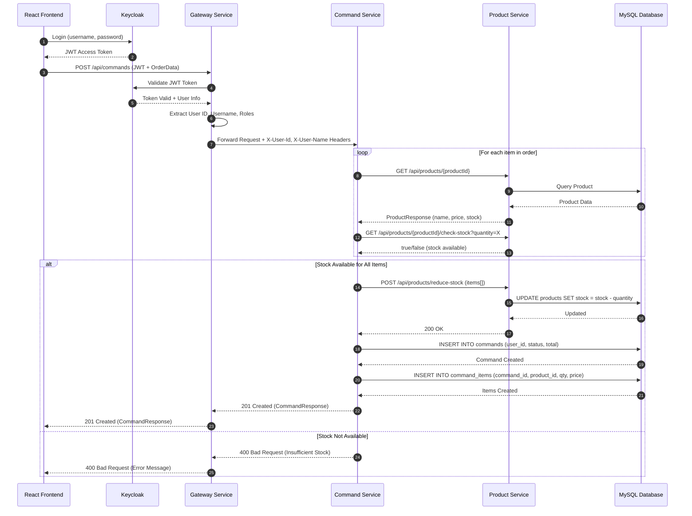
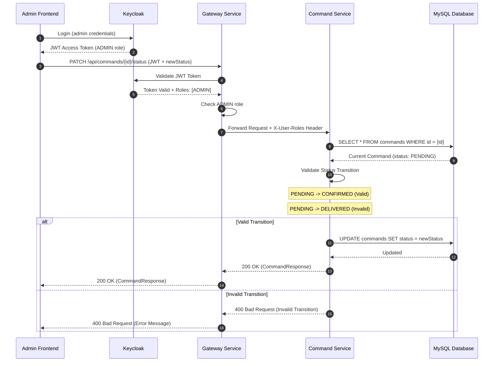
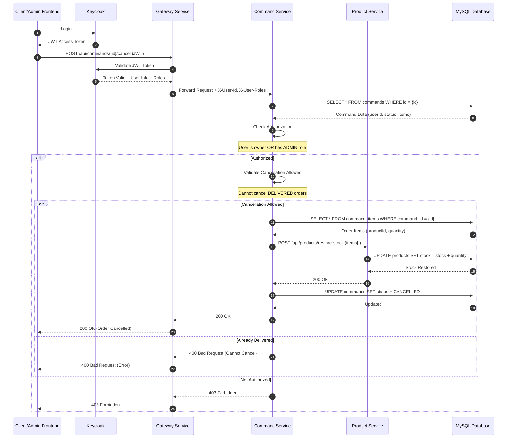
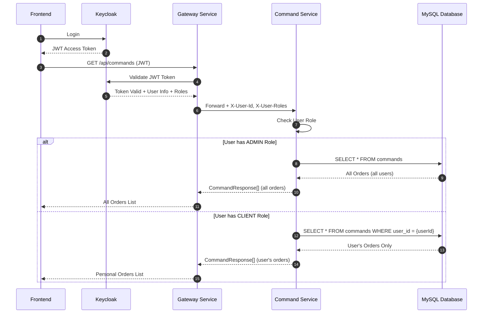
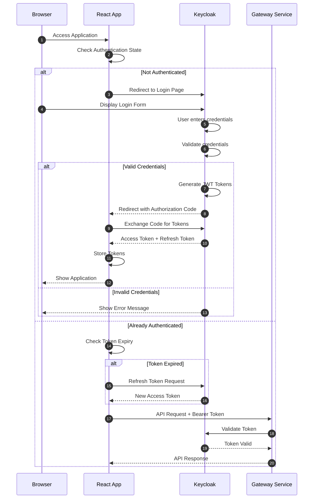

# TrustMart - Microservices E-Commerce Application

A comprehensive e-commerce platform built using microservices architecture with Spring Boot, React, Keycloak authentication, and a complete DevSecOps pipeline.

---

## Table of Contents

1. [Project Overview](#project-overview)
2. [Architecture](#architecture)
3. [Sequence Diagrams](#sequence-diagrams)
4. [Technology Stack](#technology-stack)
5. [Services Description](#services-description)
6. [Prerequisites](#prerequisites)
7. [Installation and Setup](#installation-and-setup)
8. [Running the Application](#running-the-application)
9. [API Documentation](#api-documentation)
10. [Authentication and Authorization](#authentication-and-authorization)
11. [DevSecOps Pipeline](#devsecops-pipeline)
12. [Logging and Monitoring](#logging-and-monitoring)
13. [Screenshots](#screenshots)
14. [Project Structure](#project-structure)
15. [Environment Variables](#environment-variables)
16. [Troubleshooting](#troubleshooting)
17. [Contributing](#contributing)
18. [License](#license)

---

## Project Overview

TrustMart is a full-featured e-commerce application designed with microservices architecture principles. The system allows administrators to manage products and orders while clients can browse products, add them to cart, and place orders.

### Key Features

- **Product Management**: Create, read, update, and delete products with stock management
- **Order Management**: Complete order lifecycle from creation to delivery
- **User Management**: Role-based access control with ADMIN and CLIENT roles
- **Authentication**: Secure authentication using Keycloak OAuth2/OIDC
- **Service Discovery**: Dynamic service registration and discovery using Netflix Eureka
- **API Gateway**: Centralized routing, security, and CORS handling
- **DevSecOps**: Automated security scanning and CI/CD pipeline

---

## Architecture

The application follows a microservices architecture pattern with the following components:

```
                                    +------------------+
                                    |    Keycloak      |
                                    | (Authentication) |
                                    |    Port: 8080    |
                                    +--------+---------+
                                             |
+------------------+                         |
|   React Frontend | <-----------------------+
|    Port: 8084    |                         |
+--------+---------+                         |
         |                                   |
         v                                   |
+--------+---------+                         |
|  Gateway Service | <-----------------------+
|    Port: 8083    |
+--------+---------+
         |
         +------------------------+------------------------+
         |                        |                        |
         v                        v                        v
+--------+---------+    +--------+---------+    +--------+---------+
| Discovery Service|    | Product Service  |    | Command Service  |
|  (Eureka)        |    |   Port: 8081     |    |   Port: 8082     |
|   Port: 8761     |    +--------+---------+    +--------+---------+
+------------------+             |                        |
                                 v                        v
                        +--------+---------+    +--------+---------+
                        |     MySQL        |    |     MySQL        |
                        |   (productdb)    |    |   (commanddb)    |
                        +------------------+    +------------------+
```

### Communication Flow

1. **Frontend to Gateway**: All API requests from the React frontend are routed through the API Gateway
2. **Gateway to Services**: The Gateway authenticates requests using JWT tokens from Keycloak and routes them to appropriate microservices
3. **Service Discovery**: All services register with Eureka Discovery Service for dynamic service location
4. **Inter-service Communication**: Command Service communicates with Product Service via Feign Client for stock management

---

## Sequence Diagrams

### Order Creation Process

The following diagram illustrates the complete flow when a client creates a new order:



### Order Status Update Process

The following diagram shows how an administrator updates an order status:



### Order Cancellation Process

The following diagram illustrates the order cancellation flow with stock restoration:



### View Orders Process (Role-Based Filtering)

The following diagram shows how order listing works differently for clients and admins:



### Authentication Flow

The following diagram shows the complete authentication process:



---

## Technology Stack

### Backend
| Technology | Version | Purpose |
|------------|---------|---------|
| Java | 21 | Programming language |
| Spring Boot | 3.4.1 | Application framework |
| Spring Cloud | 2024.0.0 | Microservices infrastructure |
| Spring Cloud Gateway | - | API Gateway |
| Spring Cloud Netflix Eureka | - | Service Discovery |
| Spring Security OAuth2 | - | Security and authentication |
| Spring Data JPA | - | Data persistence |
| OpenFeign | - | Declarative REST client |
| MySQL | 8.0 | Relational database |
| Keycloak | Latest | Identity and Access Management |

### Frontend
| Technology | Version | Purpose |
|------------|---------|---------|
| React | 18 | UI library |
| TypeScript | - | Type-safe JavaScript |
| Vite | - | Build tool |
| Tailwind CSS | - | Styling |
| React Query | - | Data fetching and caching |
| React Router | - | Client-side routing |
| Keycloak JS | - | Authentication client |

### DevOps
| Technology | Purpose |
|------------|---------|
| Docker | Containerization |
| Docker Compose | Multi-container orchestration |
| GitHub Actions | CI/CD pipeline |
| SonarQube | Code quality analysis |
| OWASP Dependency Check | Dependency vulnerability scanning |
| Trivy | Container security scanning |

---

## Services Description

### 1. Discovery Service (Eureka Server)
- **Port**: 8761
- **Purpose**: Service registry for dynamic service discovery
- **Features**:
  - Service registration and health monitoring
  - Load balancing support
  - Failover handling

### 2. Gateway Service
- **Port**: 8083
- **Purpose**: API Gateway and security enforcement
- **Features**:
  - Request routing to microservices
  - JWT token validation with Keycloak
  - CORS handling
  - User management endpoints (Keycloak integration)
  - Request/response logging

### 3. Product Service
- **Port**: 8081
- **Purpose**: Product catalog management
- **Features**:
  - CRUD operations for products
  - Stock management
  - Stock availability checks

### 4. Command Service
- **Port**: 8082
- **Purpose**: Order management
- **Features**:
  - Order creation and lifecycle management
  - Order status transitions
  - Integration with Product Service for stock updates
  - User-specific order filtering

### 5. Frontend
- **Port**: 8084
- **Purpose**: User interface
- **Features**:
  - Product browsing and search
  - Shopping cart functionality
  - Order placement and tracking
  - Admin dashboard for product/order/user management

---

## Prerequisites

Before running the application, ensure you have the following installed:

- **Java 21** or higher
- **Maven 3.8+**
- **Node.js 20+** and npm
- **Docker** and **Docker Compose**
- **Keycloak** (running instance or use provided Docker setup)

---

## Installation and Setup

### 1. Clone the Repository

```bash
git clone https://github.com/anassploit/microservices-ecom-app.git
cd microservices-ecom-app
```

### 2. Keycloak Setup

Before starting the application, you need to have Keycloak configured:

#### Option A: Use Existing Keycloak Instance

If you already have Keycloak running:

1. Create a realm named `trustmart`
2. Create two client applications:
   - `trustmart-frontend` (Public client for React app)
   - `trustmart-backend` (Confidential client for backend services)
3. Create realm roles:
   - `ADMIN` - Full access to all features
   - `CLIENT` - Can browse products and manage own orders
4. Create users and assign appropriate roles

#### Option B: Docker Keycloak Setup

Start Keycloak with PostgreSQL:

```bash
docker network create keycloak-network

docker run -d --name keycloak-postgres \
  --network keycloak-network \
  -e POSTGRES_DB=keycloak \
  -e POSTGRES_USER=keycloak \
  -e POSTGRES_PASSWORD=keycloak \
  postgres:15

docker run -d --name keycloak \
  --network keycloak-network \
  -p 8080:8080 \
  -e KEYCLOAK_ADMIN=admin \
  -e KEYCLOAK_ADMIN_PASSWORD=admin \
  -e KC_DB=postgres \
  -e KC_DB_URL=jdbc:postgresql://keycloak-postgres:5432/keycloak \
  -e KC_DB_USERNAME=keycloak \
  -e KC_DB_PASSWORD=keycloak \
  quay.io/keycloak/keycloak:latest start-dev
```

Then configure the realm, clients, and roles as described in Option A.

### 3. Build the Application

#### Backend Services

```bash
# Build all backend services
mvn clean package -DskipTests
```

#### Frontend

```bash
cd trustmart-frontend
npm install
npm run build
cd ..
```

---

## Running the Application

### Option 1: Using Docker Compose (Recommended)

This is the recommended way to run all services together:

```bash
# Ensure Keycloak is running first
docker start keycloak-postgres keycloak

# Start all TrustMart services
docker-compose up -d
```

This will start:
- MySQL database (port 3307)
- Discovery Service (port 8761)
- Gateway Service (port 8083)
- Product Service (port 8081)
- Command Service (port 8082)
- Frontend (port 8084)

### Option 2: Running Services Individually

Start each service in the following order:

#### 1. Start Keycloak
```bash
docker start keycloak-postgres keycloak
```

#### 2. Start Discovery Service
```bash
cd discovery-service
mvn spring-boot:run
```

#### 3. Start Gateway Service
```bash
cd gateway-service
mvn spring-boot:run
```

#### 4. Start Product Service
```bash
cd product-service
mvn spring-boot:run
```

#### 5. Start Command Service
```bash
cd command-service
mvn spring-boot:run
```

#### 6. Start Frontend
```bash
cd trustmart-frontend
npm run dev
```

### Accessing the Application

| Service | URL |
|---------|-----|
| Frontend | http://localhost:8084 |
| API Gateway | http://localhost:8083 |
| Eureka Dashboard | http://localhost:8761 |
| Keycloak Admin Console | http://localhost:8080/admin |

---

## API Documentation

All API endpoints are accessible through the Gateway Service at `http://localhost:8083`.

### Authentication

All endpoints (except public ones) require a valid JWT token in the Authorization header:

```
Authorization: Bearer <jwt_token>
```

---

### Product API

Base Path: `/api/products`

| Method | Endpoint | Description | Required Role | Request Body | Response |
|--------|----------|-------------|---------------|--------------|----------|
| GET | `/api/products` | Get all products | Any authenticated | - | `ProductResponse[]` |
| GET | `/api/products/{productId}` | Get product by ID | Any authenticated | - | `ProductResponse` |
| POST | `/api/products` | Create new product | ADMIN | `ProductRequest` | `ProductResponse` |
| PUT | `/api/products/{productId}` | Update product | ADMIN | `ProductRequest` | `ProductResponse` |
| DELETE | `/api/products/{productId}` | Delete product | ADMIN | - | `204 No Content` |
| GET | `/api/products/{productId}/check-stock` | Check stock availability | Any authenticated | Query: `quantity` | `boolean` |
| POST | `/api/products/reduce-stock` | Reduce stock (internal) | Service only | `StockUpdateRequest[]` | `200 OK` |
| POST | `/api/products/restore-stock` | Restore stock (internal) | Service only | `StockUpdateRequest[]` | `200 OK` |

#### ProductRequest Schema

```json
{
  "name": "string (required, 2-100 chars)",
  "description": "string (optional, max 1000 chars)",
  "price": "number (required, > 0.01)",
  "stock": "integer (required, >= 0)"
}
```

#### ProductResponse Schema

```json
{
  "id": "number",
  "name": "string",
  "description": "string",
  "price": "number",
  "stock": "integer",
  "createdAt": "datetime",
  "updatedAt": "datetime"
}
```

#### StockUpdateRequest Schema

```json
{
  "productId": "number",
  "quantity": "integer"
}
```

---

### Command (Order) API

Base Path: `/api/commands`

| Method | Endpoint | Description | Required Role | Request Body | Response |
|--------|----------|-------------|---------------|--------------|----------|
| GET | `/api/commands` | Get all commands | ADMIN (all) / CLIENT (own) | Query: `status` (optional) | `CommandResponse[]` |
| GET | `/api/commands/{commandId}` | Get command by ID | ADMIN / Owner | - | `CommandResponse` |
| POST | `/api/commands` | Create new command | CLIENT | `CommandRequest` | `CommandResponse` |
| PUT | `/api/commands/{commandId}` | Update command | ADMIN / Owner | `CommandRequest` | `CommandResponse` |
| PATCH | `/api/commands/{commandId}/status` | Update command status | ADMIN only | `CommandStatusUpdateRequest` | `CommandResponse` |
| POST | `/api/commands/{commandId}/cancel` | Cancel command | ADMIN / Owner | - | `200 OK` |
| DELETE | `/api/commands/{commandId}` | Delete command | ADMIN only | - | `204 No Content` |

#### CommandRequest Schema

```json
{
  "items": [
    {
      "productId": "number (required)",
      "quantity": "integer (required, >= 1)"
    }
  ]
}
```

#### CommandResponse Schema

```json
{
  "id": "number",
  "userId": "string",
  "username": "string",
  "items": [
    {
      "id": "number",
      "productId": "number",
      "productName": "string",
      "quantity": "integer",
      "unitPrice": "number",
      "totalPrice": "number"
    }
  ],
  "totalAmount": "number",
  "status": "string (PENDING|CONFIRMED|PROCESSING|SHIPPED|DELIVERED|CANCELLED)",
  "createdAt": "datetime",
  "updatedAt": "datetime"
}
```

#### Command Status Workflow

The command status follows this workflow:

```
PENDING --> CONFIRMED --> PROCESSING --> SHIPPED --> DELIVERED
    |           |             |            |
    +-----------+-------------+------------+---> CANCELLED
```

Valid status transitions:
- PENDING -> CONFIRMED, CANCELLED
- CONFIRMED -> PROCESSING, CANCELLED
- PROCESSING -> SHIPPED, CANCELLED
- SHIPPED -> DELIVERED, CANCELLED
- DELIVERED -> (final state)
- CANCELLED -> (final state)

---

### User Management API

Base Path: `/api/users`

| Method | Endpoint | Description | Required Role | Request Body | Response |
|--------|----------|-------------|---------------|--------------|----------|
| GET | `/api/users` | Get all client users | ADMIN | - | `UserResponse[]` |
| GET | `/api/users/{userId}` | Get user by ID | ADMIN | - | `UserResponse` |
| POST | `/api/users` | Create new user | ADMIN | `CreateUserRequest` | `UserResponse` |
| PUT | `/api/users/{userId}` | Update user | ADMIN | `UpdateUserRequest` | `UserResponse` |
| PATCH | `/api/users/{userId}/enabled` | Enable/disable user | ADMIN | `EnableUserRequest` | `UserResponse` |
| DELETE | `/api/users/{userId}` | Delete user | ADMIN | - | `204 No Content` |

#### CreateUserRequest Schema

```json
{
  "username": "string (required, 3-50 chars)",
  "email": "string (required, valid email)",
  "firstName": "string (required)",
  "lastName": "string (required)",
  "password": "string (required, min 6 chars)"
}
```

---

### Authentication API

Base Path: `/api/auth`

| Method | Endpoint | Description | Required Role | Request Body | Response |
|--------|----------|-------------|---------------|--------------|----------|
| POST | `/api/auth/register` | Register new client user | Public | `CreateUserRequest` | `UserResponse` |

---

## Authentication and Authorization

### Keycloak Configuration

The application uses Keycloak for identity and access management with OAuth2/OpenID Connect.

#### Realm Configuration

- **Realm Name**: trustmart
- **Token Lifespan**: Configure as needed (recommended: 5 minutes for access token, 30 minutes for refresh token)

#### Client Configuration

**trustmart-frontend (Public Client)**
- Client Protocol: openid-connect
- Access Type: public
- Valid Redirect URIs: http://localhost:8084/*
- Web Origins: http://localhost:8084

**trustmart-backend (Confidential Client)**
- Client Protocol: openid-connect
- Access Type: confidential
- Service Accounts Enabled: Yes
- Direct Access Grants: Yes

#### Roles

| Role | Description | Permissions |
|------|-------------|-------------|
| ADMIN | Administrator | Full access to products, orders, and user management |
| CLIENT | Customer | Browse products, create and manage own orders |

---

## DevSecOps Pipeline

The project includes a comprehensive GitHub Actions CI/CD pipeline with security scanning.

### Pipeline Stages

1. **SonarQube Analysis**
   - Static code analysis
   - Code quality metrics
   - Security vulnerability detection
   - Code coverage reporting

2. **OWASP Dependency Check**
   - Scans all dependencies for known vulnerabilities (CVEs)
   - Generates HTML, JSON, and SARIF reports
   - Fails build on CVSS score >= 7 (configurable)

3. **Build Application**
   - Compiles all backend services
   - Builds frontend application
   - Creates JAR artifacts

4. **Container Security Scan (Trivy)**
   - Scans Docker images for vulnerabilities
   - Checks for OS package vulnerabilities
   - Detects secrets in images
   - Generates detailed reports

5. **Security Summary**
   - Aggregates all security scan results
   - Generates pipeline summary

6. **Push Docker Images**
   - Pushes images to Docker Hub (main branch only)
   - Tags with commit SHA and latest

### Running the Pipeline

The pipeline runs automatically on:
- Push to main, master, or develop branches
- Pull requests to main or master branches
- Manual trigger via GitHub Actions UI

### Required Secrets

Configure these in your GitHub repository settings:

| Secret | Description |
|--------|-------------|
| `SONAR_TOKEN` | SonarQube authentication token |
| `SONAR_HOST_URL` | SonarQube server URL |
| `DOCKERHUB_USERNAME` | Docker Hub username |
| `DOCKERHUB_TOKEN` | Docker Hub access token |

---

## Logging and Monitoring

### Log Files

All services generate structured logs stored in the `/logs` directory:

| Log File | Description |
|----------|-------------|
| `{service}-access.log` | HTTP access logs with request/response details |
| `{service}-error.log` | Error and exception logs |
| `{service}-health.log` | Health check logs |
| `{service}.log` | General application logs |

### Log Format

Logs include:
- Timestamp
- Log level
- Service name
- User ID (for authenticated requests)
- Request ID (for traceability)
- Message and stack traces

### Accessing Logs in Docker

```bash
# View logs for a specific service
docker logs trustmart-product

# View application logs inside container
docker exec -it trustmart-product cat /app/logs/product-service.log

# Follow logs in real-time
docker logs -f trustmart-gateway
```

### Health Endpoints

All services expose health endpoints via Spring Actuator:

| Endpoint | Description |
|----------|-------------|
| `/actuator/health` | Service health status |
| `/actuator/info` | Service information |
| `/actuator/metrics` | Performance metrics |

---

## Screenshots

The following screenshots demonstrate the key features and interfaces of the TrustMart application.

### Welcome Page


The landing page of the TrustMart application displaying the main navigation and welcome message. Users can navigate to products, their cart, or login to access more features.

---

### Login Page


The Keycloak-powered login page where users authenticate using their credentials. Supports both ADMIN and CLIENT role logins with secure OAuth2/OIDC authentication.

---

### Products List


The product catalog page showing all available products with their names, descriptions, prices, and stock quantities. Administrators can add, edit, or delete products from this view.

---

### Adding a Product


The product creation form accessible to administrators. Allows entering product name, description, price, and initial stock quantity with validation.

---

### Editing a Product


The product edit modal pre-populated with existing product data. Administrators can modify any product attributes and save changes.

---

### Deleting a Product


Confirmation dialog when deleting a product. Ensures accidental deletions are prevented with a clear confirmation message.

---

### Shopping Cart


The shopping cart interface showing selected products, quantities, unit prices, and total amount. Users can adjust quantities or remove items before proceeding to checkout.

---

### Making a New Order


The order placement interface where users can review their cart contents and confirm the order. Shows order summary with all items and total amount.

---

### Client Orders List


The order history view for clients showing their personal orders with status, date, items, and total amount. Clients can only see their own orders.

---

### Client Canceling Order


The order cancellation confirmation dialog. Clients can cancel their pending orders, which triggers stock restoration.

---

### List of Orders (Admin View)


The administrative view of all orders in the system. Shows all orders from all users with filtering options by status.

---

### Changing Order Status


The order status management interface for administrators. Allows updating order status through the valid workflow (PENDING to CONFIRMED to PROCESSING to SHIPPED to DELIVERED).

---

### List of Clients


The user management interface showing all registered client users. Displays username, email, name, and account status.

---

### Delete Client


Confirmation dialog when deleting a client account. Administrators can remove user accounts from the system.

---

### DevSecOps Pipeline Success


GitHub Actions pipeline showing successful completion of all security scans including SonarQube analysis, OWASP dependency check, and Trivy container scanning.

---

### Docker Hub Containers


Docker Hub repository showing all pushed container images for the microservices after successful pipeline execution.

---

### Services Running Locally on Docker


Docker Desktop showing all TrustMart microservices running locally in containers. Displays the status of MySQL, Discovery Service, Gateway Service, Product Service, Command Service, and Frontend containers.

---

## Project Structure

```
microservices-ecom-app/
|
+-- .github/
|   +-- workflows/
|       +-- devsecops-pipeline.yml    # CI/CD pipeline configuration
|
+-- command-service/                   # Order management service
|   +-- src/
|   |   +-- main/
|   |   |   +-- java/.../commandservice/
|   |   |   |   +-- client/            # Feign clients
|   |   |   |   +-- controller/        # REST controllers
|   |   |   |   +-- dto/               # Data transfer objects
|   |   |   |   +-- entity/            # JPA entities
|   |   |   |   +-- enums/             # Enumerations
|   |   |   |   +-- exception/         # Exception handling
|   |   |   |   +-- repository/        # Data repositories
|   |   |   |   +-- service/           # Business logic
|   |   |   +-- resources/
|   |   |       +-- application.properties
|   |   |       +-- logback-spring.xml
|   |   +-- test/
|   +-- Dockerfile
|   +-- pom.xml
|
+-- discovery-service/                 # Eureka server
|   +-- src/
|   +-- Dockerfile
|   +-- pom.xml
|
+-- gateway-service/                   # API Gateway
|   +-- src/
|   |   +-- main/
|   |   |   +-- java/.../gatewayservice/
|   |   |   |   +-- config/            # Security, CORS configuration
|   |   |   |   +-- controller/        # User management endpoints
|   |   |   |   +-- dto/               # Request/Response DTOs
|   |   |   |   +-- filter/            # Gateway filters
|   |   |   |   +-- service/           # Keycloak user service
|   |   |   +-- resources/
|   |   |       +-- application.properties
|   +-- Dockerfile
|   +-- pom.xml
|
+-- product-service/                   # Product catalog service
|   +-- src/
|   |   +-- main/
|   |   |   +-- java/.../productservice/
|   |   |   |   +-- controller/
|   |   |   |   +-- dto/
|   |   |   |   +-- entity/
|   |   |   |   +-- exception/
|   |   |   |   +-- repository/
|   |   |   |   +-- service/
|   |   |   +-- resources/
|   +-- Dockerfile
|   +-- pom.xml
|
+-- trustmart-frontend/                # React frontend
|   +-- src/
|   |   +-- components/                # Reusable UI components
|   |   +-- contexts/                  # React contexts
|   |   +-- hooks/                     # Custom hooks
|   |   +-- lib/                       # Utilities and API client
|   |   +-- pages/                     # Page components
|   +-- public/
|   +-- Dockerfile
|   +-- package.json
|   +-- vite.config.ts
|
+-- docs/                              # Documentation and screenshots
+-- logs/                              # Application logs
+-- scripts/                           # Utility scripts
|   +-- populate_database.py           # Database seeding script
|   +-- requirements.txt
|
+-- docker-compose.yml                 # Main Docker Compose file
+-- docker-compose.security.yml        # Security scan Docker Compose
+-- init-db.sql                        # Database initialization
+-- owasp-suppressions.xml             # OWASP false positive suppressions
+-- pom.xml                            # Parent Maven POM
+-- sonar-project.properties           # SonarQube configuration
+-- trivy.yaml                         # Trivy configuration
+-- README.md                          # This file
```

---

## Environment Variables

### Gateway Service

| Variable | Description | Default |
|----------|-------------|---------|
| `SPRING_PROFILES_ACTIVE` | Active Spring profile | - |
| `EUREKA_CLIENT_SERVICEURL_DEFAULTZONE` | Eureka server URL | http://localhost:8761/eureka/ |
| `SPRING_SECURITY_OAUTH2_RESOURCESERVER_JWT_ISSUER_URI` | Keycloak issuer URI | http://localhost:8080/realms/trustmart |
| `KEYCLOAK_AUTH_SERVER_URL` | Keycloak server URL | http://localhost:8080 |
| `KEYCLOAK_REALM` | Keycloak realm name | trustmart |
| `KEYCLOAK_ADMIN_USERNAME` | Keycloak admin username | admin |
| `KEYCLOAK_ADMIN_PASSWORD` | Keycloak admin password | admin |
| `GATEWAY_SECRET` | Secret for internal service auth | TrustMartGatewaySecretKey2024 |
| `CORS_ALLOWED_ORIGINS` | Allowed CORS origins | http://localhost:8084 |

### Product and Command Services

| Variable | Description | Default |
|----------|-------------|---------|
| `SPRING_PROFILES_ACTIVE` | Active Spring profile | - |
| `EUREKA_CLIENT_SERVICEURL_DEFAULTZONE` | Eureka server URL | http://localhost:8761/eureka/ |
| `SPRING_DATASOURCE_URL` | MySQL connection URL | jdbc:mysql://localhost:3306/... |
| `SPRING_DATASOURCE_USERNAME` | Database username | root |
| `SPRING_DATASOURCE_PASSWORD` | Database password | root |
| `GATEWAY_SECRET` | Secret for gateway auth validation | TrustMartGatewaySecretKey2024 |

---

## Troubleshooting

### Common Issues

#### 1. Services Not Registering with Eureka

**Symptom**: Services fail to appear in Eureka dashboard

**Solution**:
- Ensure Discovery Service is running first
- Check Eureka URL configuration in service properties
- Verify network connectivity between services

#### 2. CORS Errors in Frontend

**Symptom**: Browser console shows CORS policy errors

**Solution**:
- Verify `cors.allowed-origins` includes frontend URL
- Ensure Gateway CORS configuration is correct
- Check that preflight OPTIONS requests are allowed

#### 3. JWT Token Validation Failures

**Symptom**: 401 Unauthorized errors on API calls

**Solution**:
- Verify Keycloak is running and accessible
- Check JWT issuer URI matches Keycloak configuration
- Ensure tokens are not expired
- Verify client configuration in Keycloak

#### 4. Database Connection Issues

**Symptom**: Services fail to start with database errors

**Solution**:
- Ensure MySQL is running and accessible
- Verify database credentials
- Check that databases (productdb, commanddb) exist
- Verify MySQL port is not blocked

#### 5. Service Communication Failures

**Symptom**: Command Service cannot reach Product Service

**Solution**:
- Verify both services are registered with Eureka
- Check Feign client configuration
- Ensure service names match Eureka registration

### Viewing Logs

```bash
# Docker logs
docker-compose logs -f gateway-service
docker-compose logs -f product-service
docker-compose logs -f command-service

# Application logs in container
docker exec -it trustmart-gateway ls /app/logs
```

### Restarting Services

```bash
# Restart a specific service
docker-compose restart gateway-service

# Rebuild and restart
docker-compose up -d --build product-service
```

---

## Contributing

1. Fork the repository
2. Create a feature branch (`git checkout -b feature/amazing-feature`)
3. Commit your changes (`git commit -m 'Add some amazing feature'`)
4. Push to the branch (`git push origin feature/amazing-feature`)
5. Open a Pull Request

### Code Style

- Follow Java coding conventions
- Use meaningful variable and method names
- Write unit tests for new functionality
- Document public APIs

---

## License

This project is licensed under the MIT License. See the LICENSE file for details.

---

## Contact

- **Author**: Anass
- **GitHub**: [anassploit](https://github.com/anassploit)
- **Repository**: [microservices-ecom-app](https://github.com/anassploit/microservices-ecom-app)

---

## Acknowledgments

- Spring Boot and Spring Cloud teams for the excellent frameworks
- Keycloak team for the identity management solution
- OWASP for dependency check tools
- Aqua Security for Trivy container scanner

